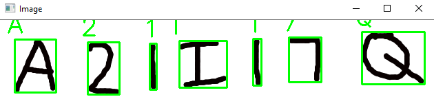

# OCR_Resnet




- This is my implementation of an OCR using Resnet. 

- Resenet is one of the best Neural Network architectures for image classification and it's biggest advantage is the fact that it as the network depth increases, it cancels negative outcomes.

- I have used the MNIST dataset for numbers and A_Z dataset from Kaggle for the letters.

- Accuracy is around 96%

- To run the model:
```
$ python ocr_handwriting.py --model handwriting.model --image images/umbc_address.png
```
